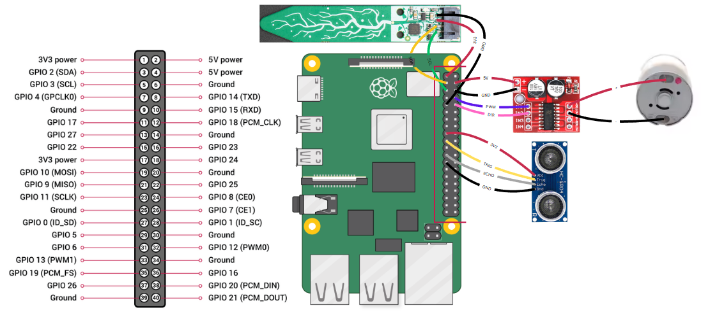

# Raspberry-Plant-Watering
*a HTL Rankweil project*

This project allows you to water your favorite plants automatically when they are thirsty. The heart of the project is a Raspberry Pi 4B, which functions as a web server, controls the pump, and reads the sensor values. And there is also a web interface, which provides you with a good overview of your plants' conditions.

**Wiring for the modules:**

**Used products:**
* Raspberry Pi 4B: [2GB RAM](https://www.berrybase.at/raspberry-pi-4-computer-modell-b-2gb-ram)
* Moisture sensor: [Adafruit STEMMA Soil Sensor](https://www.adafruit.com/product/4026)
* DC-Motor driver: [MX1508](https://de.aliexpress.com/item/1005002431361324.html?gatewayAdapt=glo2deu)
* Pump: [Diaphragm pump 6V](https://de.aliexpress.com/item/1005004761121166.html?spm=a2g0o.order_list.order_list_main.5.27f25c5fnGL01o&gatewayAdapt=glo2deu)
* Ultrasonic distance sensor: [HC-SR04](https://www.adafruit.com/product/4026)

